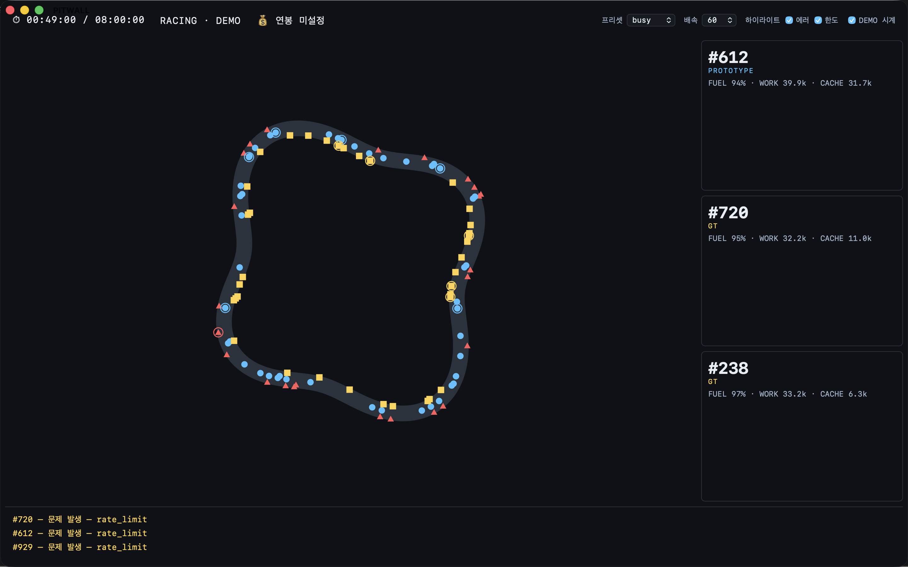
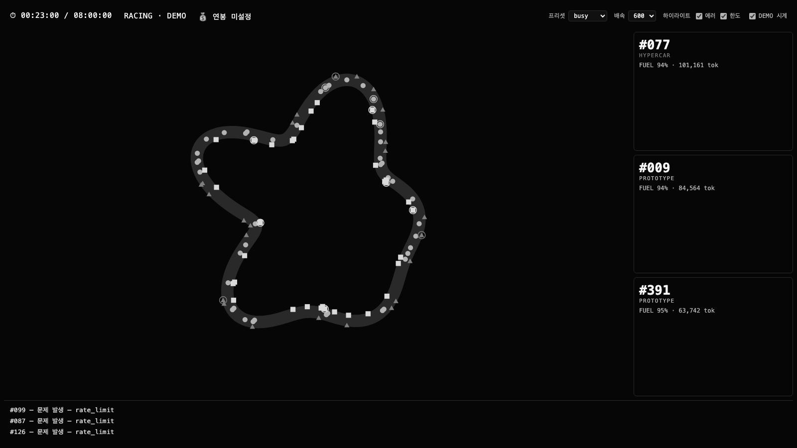

# PITWALL — MVP 확인 후 결정해야 할 것

**2026-07-30** · 대상: 커밋 `4eabade` (웹 34 kB · macOS 앱 136 kB · 343 tests)

MVP를 실제로 띄워 보고 나온 문제와, 지금 정해야 진행되는 결정을 모았다.
**추정과 관측을 섞지 않는다** — 근거가 있는 것만 "관측"으로 적었다.

---

## 0. 지금 화면

`busy` 프리셋 · 60배속 · 1440×900. 트랙 마크 98개(클러스터 86 + hot 12), 카메라 3, 라디오 3, HUD 3, 설정 컨트롤 4.

---

## 1. 가독성 — 확인된 문제

> "너무 한 화면에 많이 보인다."

스크린샷에서 원인이 네 가지로 갈린다. **하나의 문제가 아니다.**

### 1-1. 화면의 40%가 빈 공간이다 [관측]

트랙 SVG는 `viewBox="0 0 1000 1000"` 정사각인데 컨테이너는 1120×760 가로형이다.
종횡비가 맞지 않아 트랙이 왼쪽에 몰리고 **오른쪽 약 400px이 통째로 빈다.**

밀도가 높아 보이는 이유의 절반이 이것이다 — 마크 98개가 넓게 퍼진 게 아니라 좁은 영역에 눌려 있다.

**결정 D1. 트랙을 컨테이너에 맞출 것인가?**

| 안 | 내용 | 비용 |
|---|---|---|
| **A (권장)** | 트랙 생성을 가로형 viewBox(예: 1400×900)로. 실제 서킷도 가로로 길다 | `generateTrack` 좌표계 변경 + 테스트 갱신 |
| B | SVG를 정사각으로 두고 컨테이너를 좁힌다 | 빈 공간이 카메라 쪽으로 이동할 뿐 |
| C | 그대로 둔다 | — |

### 1-2. 클래스 레인이 눈에 안 보인다 [관측]

레인 오프셋이 ±14인데 트랙 폭이 34다. 1000단위 좌표가 화면에서 축소되면서
**세 레인이 사실상 한 줄로 겹쳐 보인다.** 색과 형태로는 구분되지만 "레인 분리"라는 설계 의도가 화면에 없다.

**결정 D2. 레인을 실제로 보이게 할 것인가?**

| 안 | 내용 |
|---|---|
| **A (권장)** | 오프셋을 트랙 폭에 비례하게 키운다(±14 → ±26) + 트랙 폭을 넓힌다 |
| B | 레인을 포기하고 색·형태만으로 클래스를 구분한다 (PRD §6.4 밀도 관리 근거가 약해진다) |

### 1-3. 카메라 카드가 대부분 빈칸이다 [관측]

카드가 `flex: 1`로 늘어나 각 300px 이상인데 내용은 3줄이다. **카드 면적의 80%가 비어 있다.**

**결정 D3. 카메라 카드를 어떻게 할 것인가?**

| 안 | 내용 |
|---|---|
| **A (권장)** | 카드 높이를 내용에 맞추고 남는 공간을 비운다. 슬롯 수는 그대로 |
| B | 카드에 정보를 더 넣는다 (스파크라인·최근 이벤트) — **화면이 더 복잡해진다. 지금 문제와 반대 방향** |
| C | 슬롯을 5개로 늘려 공간을 채운다 — 동상 |

### 1-4. 라디오 3줄이 같은 메시지다 [관측]

스크린샷의 세 줄이 전부 `문제 발생 — rate_limit`이다. 서로 다른 차량이지만 읽을 정보가 없다.

**결정 D4. 같은 유형을 접을 것인가?**

| 안 | 내용 |
|---|---|
| **A (권장)** | 같은 유형이 연속되면 한 줄로 접고 수를 붙인다 (`rate_limit ×3`) |
| B | 유형별 쿨다운을 라디오에도 적용 (지금은 루틴 라디오에만 있다) |

---

## 2. 검증하지 않은 핵심 가설

### 2-1. 3초 인지 테스트를 한 번도 하지 않았다 [미측정]

PRD G1의 합격 기준은 **"3초 노출 후 '바쁜가/한가한가', '사고 났나' 정답률 ≥ 80%"**다.
이 화면으로 그 테스트를 한 적이 없다. 가독성 문제를 고치기 전에 **기준선부터 재야 한다** —
안 그러면 무엇을 고쳤는지 알 수 없다.

**결정 D5. 지금 측정하고 시작할 것인가?** 사람 3~5명, 10분이면 된다.

---

## 3. 실데이터가 남긴 미결

실측(2026-07-30, Claude Code 트랜스크립트 26,438건/9.3일)에서 나온 것들.

### 3-1. 라디오가 침묵한다 [관측]

가장 붐빈 하루 4,138건에서 **에러 0건, 캐시 히트율 98.2%**였다.
→ 이벤트 라디오도 루틴 라디오도 발화 조건에 닿지 않는다. 화면의 라디오 티커가 종일 `RACE CONTROL` 한 줄이다.

시뮬레이터에서는 에러율 1.5~18%로 잘 돌지만 **실제 사용은 훨씬 조용하다.**

**결정 D6. 라디오에 무엇을 태울 것인가?**

| 안 | 내용 |
|---|---|
| **A (권장)** | 발화 조건을 넓힌다 — 세션 시작/종료, 모델 전환, 비용 마일스톤. 에러가 없어도 읽을 게 있어야 한다 |
| B | 라디오를 축소하고 그 공간을 다른 데 쓴다 |
| C | 그대로 둔다 — 침묵이 정상이라는 입장 (PRD §10.2의 "침묵은 정상"과 일치하지만, 화면 1/10을 침묵에 쓰는 셈) |

### 3-2. 차량 = 사람인가 프로젝트인가 [결정 필요]

PRD는 **차량 = 사용자 1인**으로 정의한다(§18). 그런데 실데이터는 1인 기기라 사람으로 나눌 수 없어서
**작업 디렉터리(프로젝트)를 차량으로** 삼았다.

이건 임시 대응이며 문서와 코드가 어긋난 상태다.

**결정 D7.**

| 안 | 내용 |
|---|---|
| A | 차량 = 사람. 실데이터는 다인 환경(LiteLLM)이 생길 때까지 데모로만 |
| **B (권장)** | 차량 = **"작업 단위"**로 재정의하고 배포마다 무엇에 매핑할지 설정으로 둔다(사람/프로젝트/팀). PRIV-1(익명)은 그대로 유지 |

### 3-3. 연료 예산의 출처가 없다 [미해결, PRD Q3 계열]

지금은 임포터에서 하루 $60을 하드코딩한다. 근거는 실측 중앙값($92.84/9일)뿐이다.
**실제 조직 예산을 어디서 가져올지 정해진 바 없다.**

**결정 D8.** 설정으로 받을 것인가(단순), LiteLLM 예산 API에서 읽을 것인가(v1.5), 아니면 연료 게이지를 v1에서 뺄 것인가.

---

## 4. 출시·배포

### 4-1. macOS 앱은 ad-hoc 서명이다 [관측]

이 기기에서는 돌지만 **다른 기기에서는 Gatekeeper가 막는다.**

**결정 D9.** **해소 (2026-08-22).** 공개 배포는 GitHub Pages 데모 HTML. macOS 앱은 로컬 ad-hoc. 다른 기기는 Apple 공식 경로(시스템 설정 → 개인정보 보호 및 보안 → 그래도 열기). Developer ID/$99 공증은 이 버전에 없다. 상세: `docs/superpowers/specs/2026-08-22-production-deploy-prd.md`.

### 4-2. 위젯은 다시 만들어야 한다 [확인됨]

WidgetKit은 JavaScript를 실행하지 않는다. SwiftUI 스냅샷만 그리고 갱신 주기도 시스템이 정한다(분 단위).

**결정 D10.**

| 안 | 비용 | 결과 |
|---|---|---|
| SwiftUI 위젯 재작성 | `TrackModel`은 재사용, 렌더러 폐기 | 진짜 위젯. 움직이지 않는 스냅샷 |
| **상주 창 (권장)** | **0 — 지금 앱이 그것** | 움직이는 화면. 위젯은 아님 |

"위젯"이라는 말이 **상시 보이는 작은 창**을 뜻한다면 이미 완성됐다. 홈 화면 위젯을 뜻한다면 별도 작업이다.

---

## 5. 남은 미측정

| 항목 | 상태 |
|---|---|
| 8시간 힙 증가 ≤ 50MB | **미측정.** 5분에 누수 징후 없음(30초 +2.1MB vs 300초 +1.8MB) |
| 실 GPU 프레임률 | 부분 측정. headless는 하한만 말해준다 |
| 3초 인지 정확도 | **미측정** (D5) |
| LiteLLM 실 로그 | 미확보. Q1·Q2·Q6·Q7이 여기 묶여 있다 |

---

## 우선순위 제안

| 순서 | 무엇 | 이유 |
|---|---|---|
| 1 | **D5** (3초 테스트 기준선) | 고치기 전에 재야 무엇이 나아졌는지 안다 |
| 2 | **D1 + D2** (트랙 종횡비·레인) | 가독성 문제의 절반이 여기 있고 비용이 작다 |
| 3 | **D3 + D4** (카드·라디오 정리) | 남은 절반 |
| 4 | **D7** (차량의 정의) | 문서와 코드가 어긋난 상태를 오래 두면 안 된다 |
| 5 | D6 · D8 · D9 · D10 | 방향 결정이 필요한 것들 |

**1~3번은 구현이고, 4~5번은 판단이다.** 구현은 바로 들어갈 수 있다.

---

## 부록: 흑백 확인

색을 지워도 원·삼각·사각으로 클래스가 구분된다. 접근성 이중 인코딩은 유지되고 있다 (PRD §6.3).
